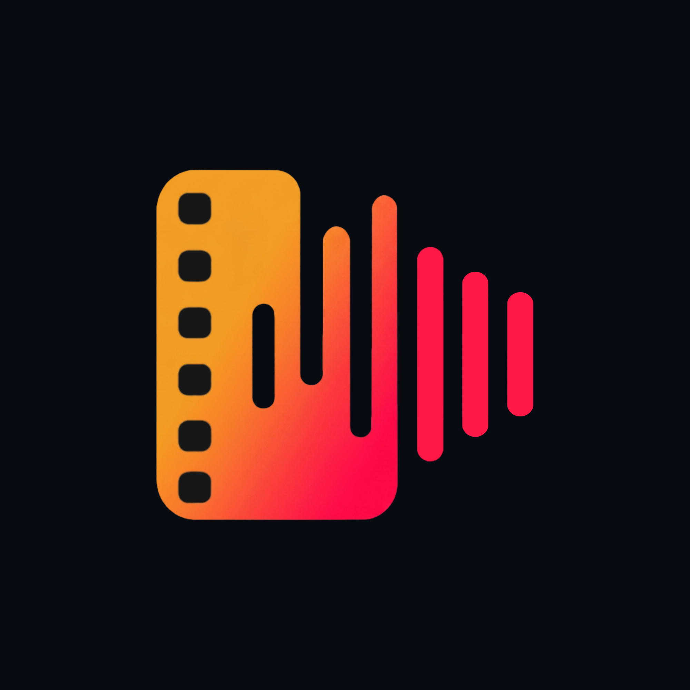

<div align="center">
  
  <h1>mensola</h1>
  <p><strong>Track what you listen to. Track what you watch. Share it with the people you care about.</strong></p>


</div>

---

## What is Mensola?

**Mensola** is a social mobile application that brings your music listening habits, movie watchlists, and social activity together in one place. Think of it as your personal cultural shelf — a place where you log what you're listening to, what you've watched, what you want to watch next, and share all of it with friends in real time.

Whether you just finished a great album, added a film to your watchlist, or want to discover what your friends are into — Mensola is the home for all of it.

---

## Features

### 🎵 Music Tracking

Log tracks, albums, and playlists you listen to. Powered by the Spotify API, Mensola gives you access to a vast music catalog so you can record exactly what you're into.

### 🎬 Movie & TV Lists

Build your personal watchlist and rate films. Backed by TMDB, the app surfaces rich movie and show metadata — cast, posters, descriptions and more.

### ✍️ Journals & Discussions

Leave your thoughts on any piece of content. Comment on a track, write a note about a film, or start a discussion with friends around something you've experienced.

### 🤝 Social Activity Feed

See what your friends are listening to and watching in real time. Follow people, discover their shelves, and find shared tastes you didn't know you had.

### 👤 Personal Profile

Your own public profile showcasing your music taste, film history, and custom lists. Shareable via deep links directly into the app.

### 📋 Custom Lists

Create curated collections — favourite soundtracks, films from a certain era, anything you want. Lists are shareable and browsable by others.

### 🔔 Notifications

Stay updated when friends follow you, comment on your content, or react to something you've shared.

### 🔗 Deep Links & Short Links

Every profile, movie list, and playlist gets a shareable short link at `mensola.app` that opens directly in the app on Android and iOS.

---

## Coming Soon

| Feature                | Description                                                        |
| ---------------------- | ------------------------------------------------------------------ |
| 📚 **Book Shelf**      | Add books alongside your music and films                           |
| 🔍 **Smart Discovery** | Personalised recommendations based on your taste                   |
| 📊 **Personal Stats**  | Weekly and monthly breakdowns of your listening and viewing habits |

---

## Architecture

Mensola is a monorepo split into three packages:

```
mensola/
├── api/       → REST API — Node.js · Express 5 · PostgreSQL 15
├── mobile/    → Mobile app — React Native · Expo SDK 57
└── web/       → Landing & beta sign-up site — Next.js 16
```

```
User (iOS / Android)
        │
        ▼
  Expo Router (mobile/)
        │  HTTP/JSON
        ▼
  Express API (api/)  ←→  PostgreSQL (database)
        │
        ├──── Spotify API        (music catalog)
        ├──── TMDB API           (film & TV data)
        ├──── Cloudflare R2      (media storage / CDN)
        └──── Google OAuth       (social sign-in)

Browser
        │
        ▼
  Next.js (web/)   ←  landing page & beta application form
```

---

## Tech Stack

### Backend — `api/`

| Layer         | Technology                                   |
| ------------- | -------------------------------------------- |
| Runtime       | Node.js + TypeScript                         |
| Framework     | Express 5                                    |
| Database      | PostgreSQL 15                                |
| Auth          | JWT (access + refresh tokens) + Google OAuth |
| Validation    | Zod                                          |
| File Storage  | Cloudflare R2 (S3-compatible)                |
| Email         | Nodemailer + SMTP (Resend)                   |
| Movie Data    | TMDB API                                     |
| Music Data    | Spotify API                                  |
| Notifications | Telegram Bot (internal alerts)               |
| Testing       | Jest + Supertest                             |
| Container     | Docker + Docker Compose                      |

### Mobile — `mobile/`

| Layer              | Technology                       |
| ------------------ | -------------------------------- |
| Framework          | React Native + Expo SDK 57       |
| Navigation         | Expo Router (file-based routing) |
| Server State       | TanStack Query v5                |
| Client State       | Zustand                          |
| UI                 | Custom components + Expo Image   |
| Storage            | Expo SecureStore + MMKV          |
| i18n               | i18next + react-i18next          |
| Auth               | Google Sign-In + JWT             |
| Push Notifications | Expo Notifications               |
| Build              | EAS Build                        |
| Platform           | Android & iOS                    |

### Web — `web/`

| Layer     | Technology               |
| --------- | ------------------------ |
| Framework | Next.js 16 (App Router)  |
| Language  | TypeScript               |
| Styling   | Vanilla CSS              |
| Deploy    | Static export compatible |

---

## Closed Beta

Mensola is currently in **closed beta**. To apply for early access:

**[mensola.app/beta](https://mensola.app/beta)** _(coming soon)_

---

## Repository Structure

Each sub-package has its own README with detailed setup and development instructions:

- [`api/README.md`](https://github.com/mensola-app/api#mensola--api) — Backend API: environment variables, Docker setup, running tests
- [`mobile/README.md`](https://github.com/mensola-app/mobile#mensola--mobile-app) — Mobile app: local development, EAS builds, environment config
- [`web/README.md`](https://github.com/mensola-app/web/#mensola--web) — Web landing site: local development and deployment

---

## License

ISC © Mensola
