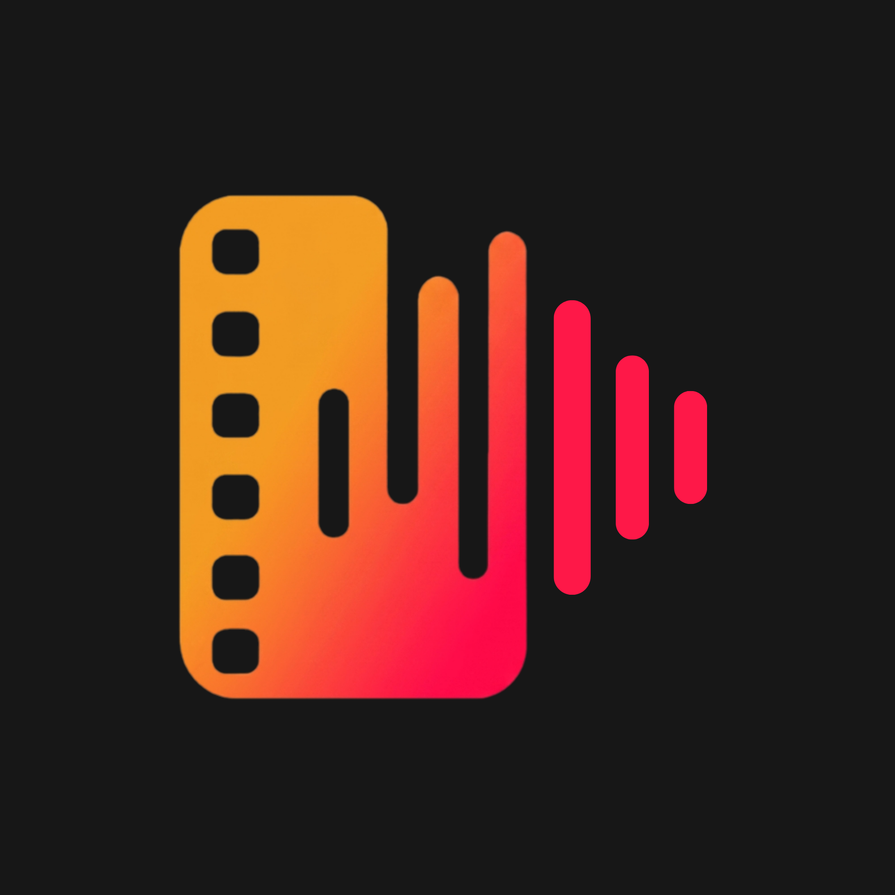

<div align="center">
  
  <h1>mensola</h1>
  <p>Müziğini, filmini takip et — arkadaşlarınla paylaş.</p>


</div>

---

## Nedir?

Mensola, müzik dinleme alışkanlıklarını, izlediğin filmleri ve sosyal etkileşimlerini tek bir platformda bir araya getiren mobil bir uygulamadır. Arkadaşlarınla ortak zevklerini keşfet, özel listeler oluştur ve anlık akışta ne izlenip ne dinlendiğini gör.

## Proje Yapısı

```
mensola/
├── api/          → REST API (Node.js + Express + PostgreSQL)
├── mobile/       → Mobil uygulama (React Native / Expo)
└── web/          → Tanıtım & beta başvuru sitesi (Next.js)
```

---

## Tech Stack

### `api/` — Backend

| Katman         | Teknoloji                    |
| -------------- | ---------------------------- |
| Runtime        | Node.js + TypeScript         |
| Framework      | Express 5                    |
| Veritabanı     | PostgreSQL 15                |
| Auth           | JWT (access + refresh token) |
| Doğrulama      | Zod                          |
| Dosya Depolama | Cloudflare R2 (S3-uyumlu)    |
| E-posta        | Nodemailer + SMTP            |
| Film Verisi    | TMDB API                     |
| Müzik Verisi   | Spotify API                  |
| Test           | Jest + Supertest             |
| Container      | Docker + Docker Compose      |

### `mobile/` — Mobil Uygulama

| Katman           | Teknoloji                      |
| ---------------- | ------------------------------ |
| Framework        | React Native + Expo (SDK 57)   |
| Navigasyon       | Expo Router (file-based)       |
| State / Fetching | TanStack Query v5              |
| UI               | Custom components + Expo Image |
| Platform         | Android & iOS                  |
| Build            | EAS Build                      |

### `web/` — Tanıtım Sitesi

| Katman    | Teknoloji               |
| --------- | ----------------------- |
| Framework | Next.js 16 (App Router) |
| Dil       | TypeScript              |
| Stil      | Vanilla CSS             |
| Deploy    | Statik export uyumlu    |

---

## Kurulum

### Gereksinimler

- Node.js 20+
- Docker & Docker Compose
- Expo CLI (`npm install -g expo-cli`)

---

### API

```bash
cd api

# Bağımlılıkları yükle
npm install

# .env dosyasını düzenle (api/.env)

# Geliştirme ortamında çalıştır (Docker ile)
npm run docker:dev

# Geliştirme ortamında çalıştır (Docker olmadan)
npm run dev
```

Docker ile çalıştırıldığında API `http://localhost:3457` adresinde hizmet verir.

#### Ortam Değişkenleri (`api/.env`)

| Değişken                   | Açıklama                                    |
| -------------------------- | ------------------------------------------- |
| `PORT`                     | API'nin dinleyeceği port (varsayılan: 3000) |
| `POSTGRES_HOST`            | PostgreSQL host                             |
| `POSTGRES_USER`            | Veritabanı kullanıcısı                      |
| `POSTGRES_PASSWORD`        | Veritabanı şifresi                          |
| `POSTGRES_DB`              | Veritabanı adı                              |
| `JWT_SECRET`               | Access token imzalama anahtarı              |
| `JWT_REFRESH_SECRET`       | Refresh token imzalama anahtarı             |
| `SMTP_HOST` / `SMTP_PORT`  | E-posta sunucusu                            |
| `SMTP_USER` / `SMTP_PASS`  | E-posta kimlik bilgileri                    |
| `TMDB_API_KEY`             | TMDB film verisi API anahtarı               |
| `SPOTIFY_CLIENT_ID/SECRET` | Spotify müzik verisi                        |
| `R2_ACCESS_KEY_ID`         | Cloudflare R2 erişim anahtarı               |
| `R2_SECRET_ACCESS_KEY`     | Cloudflare R2 gizli anahtar                 |
| `R2_BUCKET_NAME`           | R2 bucket adı                               |
| `R2_PUBLIC_URL`            | CDN public URL                              |
| `TELEGRAM_BOT_TOKEN`       | Telegramdan alınmış bot token               |
| `TELEGRAM_CHAT_ID`         | Telegram botunun id bilgisi                 |

#### Docker Komutları

```bash
# Production
npm run docker:prod

# Geliştirme
npm run docker:dev

# Test ortamı
npm run docker:test

# Durdur
npm run docker:dev:down
```

#### Testler

```bash
cd api
npm test
# veya Docker ile:
npm run docker:test
```

---

### Mobil Uygulama

```bash
cd mobile

# Bağımlılıkları yükle
npm install

# Expo geliştirme sunucusunu başlat
npm start

# Android emülatör
npm run android

# iOS simülatör
npm run ios
```

API adresini `mobile/.env` içinden ayarla.

---

### Web (Tanıtım Sitesi)

```bash
cd web

# Bağımlılıkları yükle
npm install

# Geliştirme sunucusu
npm run dev
# → http://localhost:3000

# Production build
npm run build
```

---

## Mimari

```
Kullanıcı (iOS / Android)
        │
        ▼
  Expo Router (mobile/)
        │  HTTP/JSON
        ▼
  Express API (api/)
        │
        ├──── Spotify API
        ├──── TMDB API
        ├──── PostgreSQL (veritabanı)
        └──── Cloudflare R2 (medya dosyaları)

Tarayıcı
        │
        ▼
  Next.js (web/)   ← beta başvuru formu / tanıtım
```

---

## Mevcut Özellikler

- 🎵 **Müzik Takibi** — Parça, albüm, playlist kaydı
- 🎬 **Film & Dizi Listesi** — Film ekleme, puanlama, izlenecekler listesi
- ✍️ **Günlük & Etkileşim** — İçerikler üzerine düşünce paylaşımı ve tartışma
- 🤝 **Ortak Zevkler & Takip** — Arkadaşların anlık aktivite akışı
- 👤 **Sosyal Profil** — Kişisel profil ve takipçi sistemi
- 📋 **Özel Listeler** — Favori film ve şarkılardan özel koleksiyonlar

### Yakında

- 📚 Kitap Rafı
- 🔍 Akıllı Keşif (kişiselleştirilmiş öneriler)
- 📊 Kişisel İstatistikler

---

## Kapalı Beta

Uygulama şu an **kapalı beta** aşamasındadır. Başvuru için:
**[mensola.app/beta](https://mensola.app/beta)** _(yakında)_

---

## Lisans

ISC © Mensola
